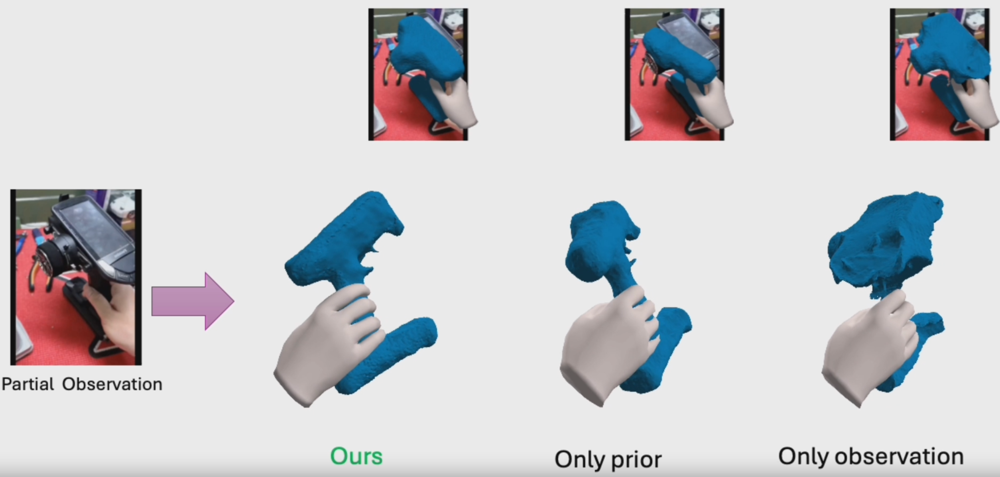

## [ICCV'25] MagicHOI: Leveraging 3D Priors for Accurate Hand-object Reconstruction from Short Monocular Video Clips

[ [Project Page](https://byran-wang.github.io/MagicHOI) ]
[ [ArXiv](https://arxiv.org/pdf/2508.05506) ]
[ [Video](https://www.youtube.com/watch?v=G0gmHxgnDxA) ]


Authors: [Shibo Wang](https://byran-wang.github.io/ShiboWang), Haonan He, [Maria Parelli](https://scholar.google.com/citations?user=ipSS2ToAAAAJ&hl=en), [Christoph Gebhardt](https://ait.ethz.ch/people/cgebhard), [Zicong Fan](https://zc-alexfan.github.io/), [Jie Song](https://ait.ethz.ch/people/song)


### News

- 2025.6.26: MagicHOI is accepted to ICCV'25!
- 2025.10.18: MagicHOI beta is released!

<p align="left">
    
</p>


This repository accompanies MagicHOI, a method for reconstructing hands and objects from short monocular videos by leveraging novel-view synthesis priors to regularize occluded object regions.


### Features
- **Download resources:** Instructions for obtaining *in-the-wild* videos from MagicHOI and the corresponding preprocessed datasets.  
- **Data preparation:** Scripts for preprocessing and training models on your own custom videos.  
- **Interactive viewer:** A tool to visualize and interact with the model’s predictions.  
- **Evaluation tools:** Code to evaluate performance and compare results between MagicHOI and SOTA methods on the HO3D dataset.  
- **Reconstruction framework:** A complete framework for reconstructing dynamic hand–object interactions using novel view synthesis priors.  


### TODOs

- [x] Object model training code  
- [x] Hand-object alignment code  
- [x] Evaluation code
- [x] Result visualization
- [ ] Custom dataset
- [ ] In-the-wild dataset


### Documentation

- [`docs/setup.md`](docs/setup.md)
- [`docs/download.md`](docs/download.md)


### Getting Started

1. **Get a copy of the code**

   ```bash
   git clone git@github.com:byran-wang/MagicHOI.git
   cd MagicHOI; git submodule update --init --recursive
   ```

1. **Set up environments**
    - Follow the instructions here: [`docs/setup.md`](docs/setup.md).
2. **Download**
    - Follow the instructions here: [`docs/download.md`](docs/download.md).

3. **Train the object model on a preprocessed sequence**
   ```bash
   python run.py --execute_list only_3d --process_list rm train export --seq_list hold_MC1_ho3d.0
   python run.py --mute --execute_list only_3d --process_list validate gen_cond_depth align save_align --seq_list hold_MC1_ho3d.0
   python run.py --mute --execute_list only_ref --process_list rm train export --seq_list hold_MC1_ho3d.0   
   python run.py --mute --execute_list 3d_ref --process_list rm train export --seq_list hold_MC1_ho3d.0
   python run.py --mute --execute_list 3d_ref --process_list validate --seq_list hold_MC1_ho3d.0
   python run.py --mute --execute_list 3d_ref_weight --process_list rm train export --seq_list hold_MC1_ho3d.0
   ```
4. **Align object to hand**
   ```bash
   python run.py --execute_list 3d_ref_weight --process_list align_hand_object_h align_hand_object_r align_hand_object_o align_hand_object_ho --seq_list hold_MC1_ho3d.0 --rebuild
   ```
5. **Visualize the reconstruction result**
   - After reconstructing the object and aligning the hand to the object, visualize the hand-object pair with AITViewer.
   - The available items for `--seq_list` can be obtained from `run.py`.
   ```bash
    python run.py --execute_list 3d_ref_weight --process_list vis_ait --seq_list hold_MC1_ho3d.0
   ```

6. **Evaluate the reconstruction result**
   - Evaluate results for all sequences against ground truth:
    ```bash
    python run.py --execute_list 3d_ref_weight --process_list eval_step_ho_pose_refine --seq_list all --rebuild
    ```    
   - Merge the per-sequence evaluation results:
    ```bash
    python run.py --execute_list 3d_ref_weight --process_list eval_summary_ho --seq_list hold_ABF12_ho3d.180 --rebuild
    ```  
   - The merged metrics are written to `<project_dir>/outputs/metrics_summary/metrics_ho_pose_refine_results.txt`.

### Official Citation 

```bibtex
@article{wang2025magichoi,
  title={MagicHOI: Leveraging 3D Priors for Accurate Hand-object Reconstruction from Short Monocular Video Clips},
  author={Wang, Shibo and He, Haonan and Parelli, Maria and Gebhardt, Christoph and Fan, Zicong and Song, Jie},
  journal={arXiv preprint arXiv:2508.05506},
  year={2025}
}
```


### Contact

For technical questions, please create an issue. For other questions, please contact the [first author](https://byran-wang.github.io/ShiboWang).

### Acknowledgments

The authors would like to thank: [Muhammed Kocabas](https://is.mpg.de/ps/person/mkocabas), [Xu Chen](https://xuchen-ethz.github.io/), [Bonan Liu](https://liubonan123.github.io/) for detailed discussions and insightful feedback, [Handi Yin](https://handiyin.github.io/) for support and International Max Planck Research School for Intelligent Systems (IMPRSIS) for supporting [Maria Parelli](https://scholar.google.com/citations?user=ipSS2ToAAAAJ&hl=en).

Our code benefits a lot from [threestudio](https://github.com/threestudio-project/threestudio), [hold](https://github.com/zc-alexfan/hold), [aitviewer](https://github.com/eth-ait/aitviewer), [hloc](https://github.com/cvg/Hierarchical-Localization). If you find our work useful, consider checking out their work.
